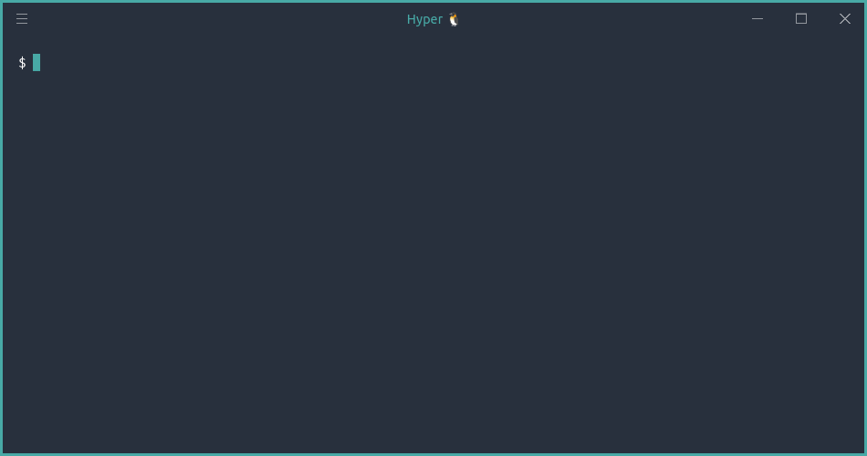

<h1 align="center">
  <br>
  
  <br><br>
  Pinguim Criativo Theme for <a href="https://hyper.is">Hyper</a>
  <br>
</h1>

<p align="center">
  
</p>

> A simple theme using a Pinguim Criativo color palette.

<br>

# Installation

There are 2 different ways to install pinguimcriativo-theme on Hyper.

#### 1. Install using the hyper CLI (recommended)

```shell
$ hyper i hyper-pinguimcriativo-theme
```

#### 2. Install using config file

Add `hyper-pinguimcriativo-theme` to the plugins list in your `~/.hyper.js` config file.

```shell
plugins: [
  'hyper-pinguimcriativo-theme'
]
```

<br>

#### Activating theme

After installing it, you need to activate the theme. You can do so by following these steps:

1.  Start Hyper;
2.  Go to `View -> Full Reload` or pressing `Ctrl + Shift + F5`.

<br>

# Maintainer

[](https://github.com/Lavrudin)

[Durval Henrique<br>
(Lavrudinho)](https://github.com/Lavrudin)

<br>

# License

[MIT License](./LICENSE.md)
